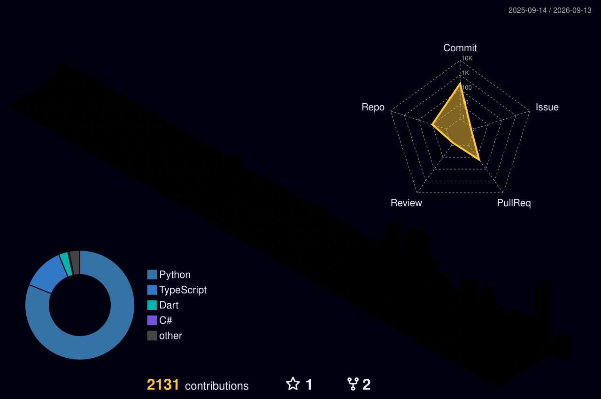
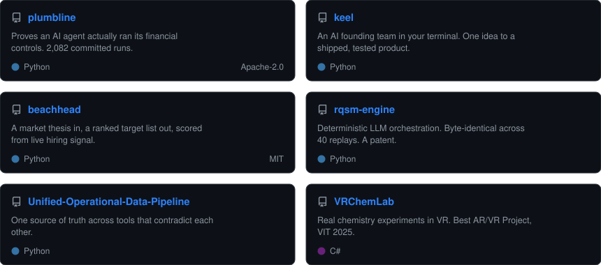

# Bhargav Raghavendra

### I take a vague problem and come back with the shipped thing.

Founder of **[Wivme](https://wivmeai.com)** &nbsp;·&nbsp; two published patents &nbsp;·&nbsp; I build the whole product, mostly on my own

---

I built Wivme's product end to end on my own: two Flutter apps, a React dashboard, a Go backend, and the Python retrieval engine behind it, then took it into a live school pilot. Before that, VR for hospitals and AR for classrooms. Two published patents, one on making LLM orchestration deterministic and auditable.

The thread through all of it is the same move: **find the thing nobody measures, build the instrument that measures it, then follow what it says even when it kills the plan.**

<a href="#selected-work">
<picture>
  <source media="(prefers-color-scheme: dark)" srcset="panels/projects-dark.svg">
  <source media="(prefers-color-scheme: light)" srcset="panels/projects-light.svg">
  
</picture>
</a>

 

## Selected work

<table>
<tr><td width="27%" valign="top">

### [plumbline](https://github.com/Bhargs24/plumbline)

`Python` · `Apache-2.0`

[Read the report ↗](https://bhargs24.github.io/plumbline/report.html)

</td><td valign="top">

**Evidence that AI-operated financial controls actually ran.** An agent can reach the correct outcome on 99.4% of runs and still skip a mandatory duplicate check on a third of them. The payment succeeds, the confirmation is byte-identical to a correct run, and no output-level eval will ever show it.

So I built the harness that catches it: declare the invariants a run must never violate, attack them with rewordings a correct agent must be indifferent to, and name the step where it broke, with a confidence interval.

Then my own headline result turned out to be an artifact of an unfair baseline. I retracted it, fixed the baseline, re-ran all 768 trials, and published the correction instead of the finding I wanted. **2,082 live runs are committed**, so anyone can recheck every published number without spending a cent.

</td></tr>
<tr><td valign="top">

### [keel](https://github.com/Bhargs24/keel)

`Python` · open source

</td><td valign="top">

**An AI founding team in your terminal.** One idea in, a shipped product out: market research, the business case, the product spec, a design system, the architecture, a feasibility gate, then it drives Claude Code or Cursor to write and secure the actual code.

It is built for the part everyone skips, which is knowing what to build and why, in what order, and proving it works before real users arrive. One rule never bends: it has to be genuinely better than what already exists, never a clone.

</td></tr>
<tr><td valign="top">

### [beachhead](https://github.com/Bhargs24/beachhead)

`Python` · `MIT`

</td><td valign="top">

**A market thesis in, a ranked target list out.** A company's open roles are the cheapest honest read on what it is building right now, so this scores a market off live job postings.

Every account anchors to one named open role and links straight to it, which makes the score evidence you can click rather than a black box. A real run maps 32 physical-AI and robotics companies across eight segments in about a minute. The thesis lives in a config file, so it retargets to a new sector without touching code.

</td></tr>
<tr><td valign="top">

### [rqsm-engine](https://github.com/Bhargs24/rqsm-engine)

`Python` · `FastAPI`

Patent IN202641086881

</td><td valign="top">

**The basis of a published patent.** LLM tutors are easy to demo and impossible to audit: ask for the same chapter twice and you get two different lessons. A school cannot build on "usually good."

So the control flow moves off the model into a deterministic state machine. The model generates language, the machine decides what happens next. **Byte-identical output across 40 replay runs**, and every transition logged with a reason code.

</td></tr>
<tr><td valign="top">

### [Unified Operational Data Pipeline](https://github.com/Bhargs24/Unified-Operational-Data-Pipeline)

`Python`

</td><td valign="top">

**One source of truth across tools that disagree.** A deal is Closed-Won in the CRM, its invoice is Unpaid in accounting, and its project still shows Started in the PM tool. Automations that blindly sync those three just spread the wrong state faster.

This sits above them, detects the contradictions, and resolves them under explicit ownership rules. Invoice status resolves automatically; deal status is held for a human, because revenue recognition should not be automated away.

</td></tr>
</table>

 

## Patents

Both published with the Intellectual Property Office of India.

**[IN202641086881](https://github.com/Bhargs24/rqsm-engine) · Deterministic orchestration of multi-role conversational sequences**  
Moves every control-flow decision off the language model into a deterministic layer, so an LLM-driven session becomes reproducible and auditable. The model turns into a swappable execution backend.

**IN202641032832 · Contextual visualization and interaction with industrial equipment** *(co-inventor)*  
A technician points a headset at a machine, sees its components as holographic overlays aligned to the real hardware, and asks questions in plain language. A marker for the pose, CAD for the geometry, retrieval-augmented generation for the answer. No depth sensors, no external tracking rig.

 

## Also built

**[Wivme](https://wivmeai.com)** · an audio-first retention layer for K-12. Schools teach, students forget roughly two thirds of it within a day, and nothing in between measures whether it stuck. Wivme models each concept's decay per student and schedules recall before it is lost.

Five surfaces and eight repositories, largely solo. [The site](https://github.com/Bhargs24/WivmeWebsite), and the prototypes it grew from: **[phase 1](https://github.com/Bhargs24/Wisme-DevPhase1)** · **[phase 2](https://github.com/Bhargs24/Wisme-Dev2)** · **[the research build](https://github.com/Bhargs24/Wisme_ResearchApp2)** · **[research plus the data pipeline](https://github.com/Bhargs24/wisme_researchapp)**

**[VRChemLab](https://github.com/Bhargs24/VRChemLab)** · real chemistry experiments in VR for schools with no lab. Best AR/VR Project, VIT 2025.
**[Inferno](https://github.com/Bhargs24/Inferno)** · a fire drill you can fail, graded against the building's real evacuation protocol. Team build, I did the XR interaction layer. Best UI/UX, Yantra 2025.
**[Xposure](https://github.com/Bhargs24/Xposure)** · exposure therapy where the therapist turns the intensity dial live, mid-session. Team build, I did the XR interaction and the therapist UI.

Alongside these, a year of surgical-training VR at a healthcare startup in London, validated with UCLH clinicians.

 

## Stack

 

## Contribution activity

<picture>
  <source media="(prefers-color-scheme: dark)" srcset="https://raw.githubusercontent.com/Bhargs24/Bhargs24/output/github-contribution-grid-snake-dark.svg">
  <source media="(prefers-color-scheme: light)" srcset="https://raw.githubusercontent.com/Bhargs24/Bhargs24/output/github-contribution-grid-snake.svg">
  
</picture>
