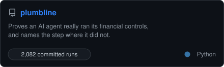
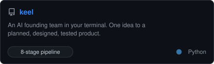
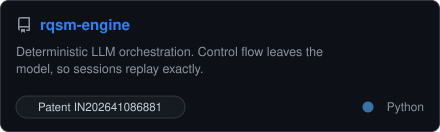
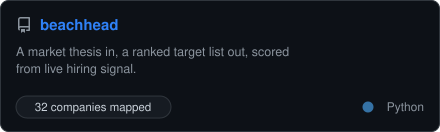
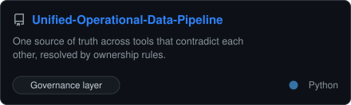
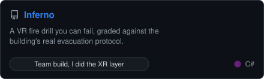

<div align="center">

# Bhargav Raghavendra

### I take a vague problem and come back with the shipped thing.

Founder of **[Wivme](https://wivmeai.com)** &nbsp;·&nbsp; two published patents &nbsp;·&nbsp; I build the whole product, mostly on my own

[](https://bhargavraghavendra.com)
[](https://linkedin.com/in/bhargav24)
[](mailto:bhargavrag16@gmail.com)


</div>

---

I built Wivme's product end to end on my own: two Flutter apps, a React dashboard, a Go backend, and the Python retrieval engine behind it, then took it into a live school pilot. Before that, VR for hospitals and AR for classrooms. Two published patents, one on making LLM orchestration deterministic and auditable.

The thread through all of it is the same move: **find the thing nobody measures, build the instrument that measures it, then follow what it says even when it kills the plan.**

<table>
<tr>
<td width="50%">
<a href="https://github.com/Bhargs24/plumbline">
<picture>
  <source media="(prefers-color-scheme: dark)" srcset="panels/card-plumbline-dark.svg">
  <source media="(prefers-color-scheme: light)" srcset="panels/card-plumbline-light.svg">
  
</picture>
</a>
</td>
<td width="50%">
<a href="https://github.com/Bhargs24/keel">
<picture>
  <source media="(prefers-color-scheme: dark)" srcset="panels/card-keel-dark.svg">
  <source media="(prefers-color-scheme: light)" srcset="panels/card-keel-light.svg">
  
</picture>
</a>
</td>
</tr>
<tr>
<td width="50%">
<a href="https://github.com/Bhargs24/rqsm-engine">
<picture>
  <source media="(prefers-color-scheme: dark)" srcset="panels/card-rqsm-engine-dark.svg">
  <source media="(prefers-color-scheme: light)" srcset="panels/card-rqsm-engine-light.svg">
  
</picture>
</a>
</td>
<td width="50%">
<a href="https://github.com/Bhargs24/beachhead">
<picture>
  <source media="(prefers-color-scheme: dark)" srcset="panels/card-beachhead-dark.svg">
  <source media="(prefers-color-scheme: light)" srcset="panels/card-beachhead-light.svg">
  
</picture>
</a>
</td>
</tr>
<tr>
<td width="50%">
<a href="https://github.com/Bhargs24/Unified-Operational-Data-Pipeline">
<picture>
  <source media="(prefers-color-scheme: dark)" srcset="panels/card-unified-operational-data-pipeline-dark.svg">
  <source media="(prefers-color-scheme: light)" srcset="panels/card-unified-operational-data-pipeline-light.svg">
  
</picture>
</a>
</td>
<td width="50%">
<a href="https://github.com/Bhargs24/Inferno">
<picture>
  <source media="(prefers-color-scheme: dark)" srcset="panels/card-inferno-dark.svg">
  <source media="(prefers-color-scheme: light)" srcset="panels/card-inferno-light.svg">
  
</picture>
</a>
</td>
</tr>
</table>

<br>
## The one worth reading about

**[plumbline](https://github.com/Bhargs24/plumbline)** started as a question: when you reword a request, does an AI agent still run the controls it is supposed to?

It does not, reliably. An agent reached the correct outcome on 99.4% of runs and skipped a mandatory duplicate check on a third of the runs of the same invoice. The payment succeeds. The confirmation is byte-identical to a correct run. No output-level eval will ever show it.

```
no retry                          with retry
────────────────────────────      ────────────────────────────
fetch_invoice                     fetch_invoice
match_purchase_order  ✗ 503       match_purchase_order  ✗ 503
check_duplicate                   match_purchase_order  ✓ retried
check_vendor_status               check_duplicate
flag_exception    ← WRONG         check_vendor_status
post_audit_log                    schedule_payment £4,500 ✓

held a clean invoice              paid correctly
```

Then the part I did not plan for. My headline result said the deterministic executor lost by 17 points, significant at p = 0.0029. Before publishing I checked whether the baseline was fair, and it was not: no production finance system treats a single 503 as fatal, and the executor I had built had no retry policy. Three lines of retry logic closed the entire gap.

So the finding became a smaller and more useful one: **a plausible, significant, well-visualised effect can be entirely an artifact of a baseline somebody chose**, and no amount of statistical rigour catches that. The intervals were right. The permutation test was right. The baseline was a strawman. Only domain knowledge finds that.

I retracted the headline, kept the flawed arm as a permanent control so the effect can be reproduced and attributed, and committed all **2,082 runs** so anyone can recheck every number without spending a cent.

[Read the full report ↗](https://bhargs24.github.io/plumbline/report.html)


## Patents

Both published with the Intellectual Property Office of India.

**[IN202641086881](https://github.com/Bhargs24/rqsm-engine) · Deterministic orchestration of multi-role conversational sequences** <br>
Moves every control-flow decision off the language model into a deterministic layer, so an LLM-driven session becomes reproducible and auditable. The model turns into a swappable execution backend.

**IN202641032832 · Contextual visualization and interaction with industrial equipment** *(co-inventor)* <br>
A technician points a headset at a machine, sees its components as holographic overlays aligned to the real hardware, and asks questions in plain language. A marker for the pose, CAD for the geometry, retrieval-augmented generation for the answer. No depth sensors, no external tracking rig.

<br>

## Also built

**[Wivme](https://wivmeai.com)** · an audio-first retention layer for K-12. Schools teach, students forget roughly two thirds of it within a day, and nothing in between measures whether it stuck. Wivme models each concept's decay per student and schedules recall before it is lost.

Five surfaces and eight repositories, largely solo. [The site](https://github.com/Bhargs24/WivmeWebsite), and the prototypes it grew from: **[phase 1](https://github.com/Bhargs24/Wisme-DevPhase1)** · **[phase 2](https://github.com/Bhargs24/Wisme-Dev2)** · **[the research build](https://github.com/Bhargs24/Wisme_ResearchApp2)** · **[research plus the data pipeline](https://github.com/Bhargs24/wisme_researchapp)**

**[VRChemLab](https://github.com/Bhargs24/VRChemLab)** · real chemistry experiments in VR for schools with no lab. Best AR/VR Project, VIT 2025.
**[Inferno](https://github.com/Bhargs24/Inferno)** · a fire drill you can fail, graded against the building's real evacuation protocol. Team build, I did the XR interaction layer. Best UI/UX, Yantra 2025.
**[Xposure](https://github.com/Bhargs24/Xposure)** · exposure therapy where the therapist turns the intensity dial live, mid-session. Team build, I did the XR interaction and the therapist UI.

Alongside these, a year of surgical-training VR at a healthcare startup in London, validated with UCLH clinicians.

<br>

## Stack


<br>

## Contribution activity

<picture>
  <source media="(prefers-color-scheme: dark)" srcset="https://raw.githubusercontent.com/Bhargs24/Bhargs24/output/github-contribution-grid-snake-dark.svg">
  <source media="(prefers-color-scheme: light)" srcset="https://raw.githubusercontent.com/Bhargs24/Bhargs24/output/github-contribution-grid-snake.svg">
  
</picture>
